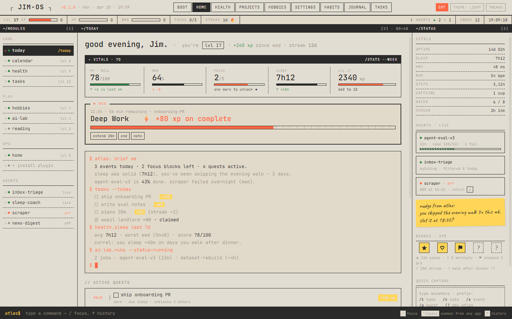
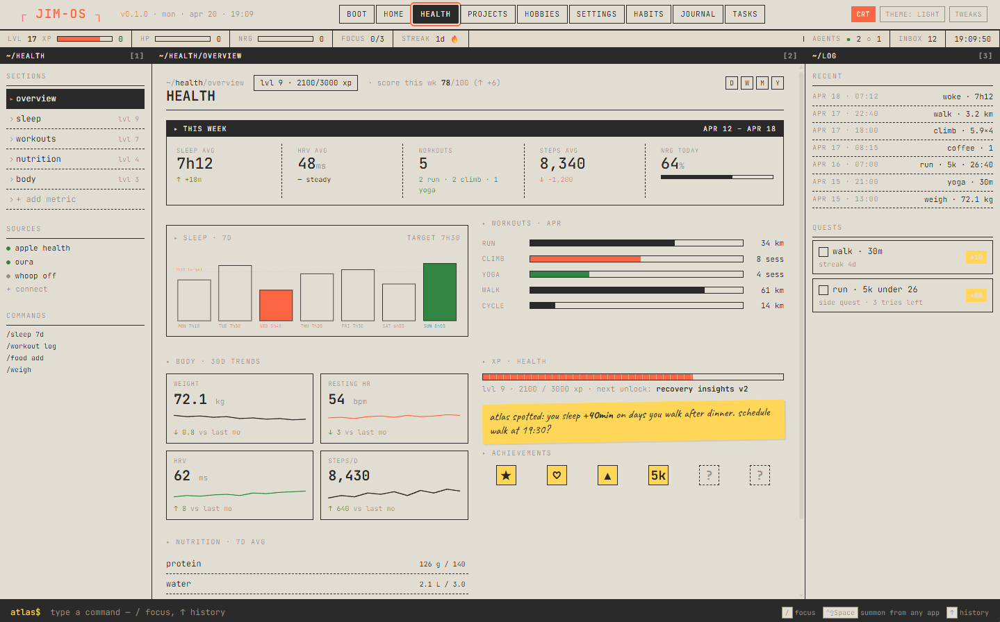
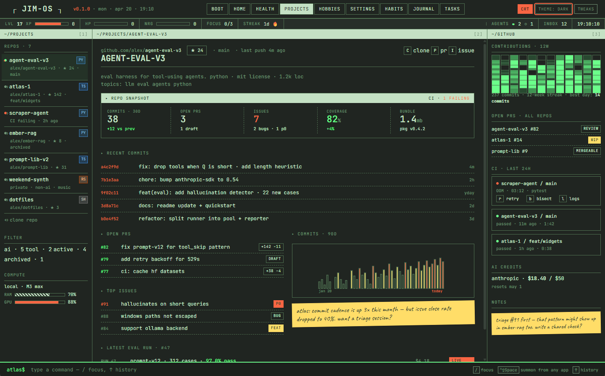
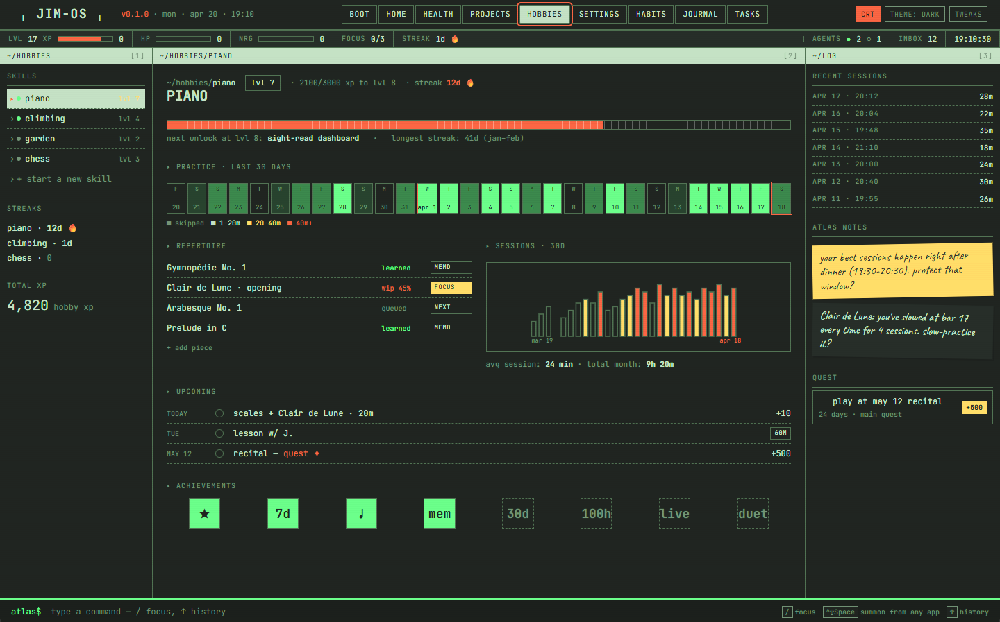
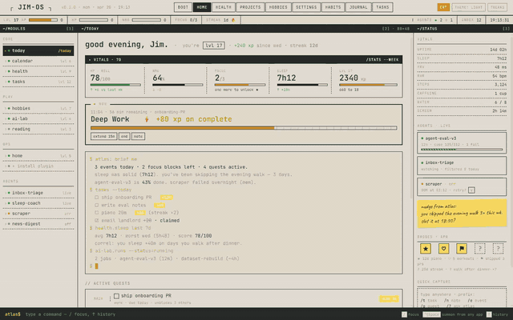

# Atlas 1

> **Life console** — terminal × game HUD for managing calendar, hobbies, health, work, play, and AI projects. Local-first, plain-text vault, plugin-based. Open-source and forkable.

[](https://github.com/dontcallmejames/atlas-1/actions/workflows/ci.yml)
[](./LICENSE)

## What it is

Atlas 1 is a single desktop app that pulls the parts of your life worth tracking — tasks, journal, habits, rituals — into one keyboard-driven console. Everything lives as plain text in a folder you own. Everything extensible is a plugin.

Why a fork, not an account: your data stays local, your instance is yours, and the author's opinions (XP bars, HP/NRG/FOCUS, terminal aesthetic) are one fork away from whatever you prefer.

## Screenshots

<table>
  <tr>
    <td></td>
    <td></td>
  </tr>
  <tr>
    <td></td>
    <td></td>
  </tr>
</table>

> Note: the health, projects, and hobbies screens above are **design previews** showing the full HUD treatment. v1 ships with `tasks`, `journal`, and `habits` plugins wired up — bring those modules to life by writing or installing plugins that register views for those screens (see [`docs/PLUGIN_API.md`](./docs/PLUGIN_API.md)).



## Install (released installer)

Grab the latest installer for your OS from the [Releases page](https://github.com/dontcallmejames/atlas-1/releases).

Atlas 1 is not code-signed. You'll see a warning:
- **Windows:** SmartScreen → "More info" → "Run anyway".
- **macOS:** Right-click the `.app` → Open → "Open anyway".
- **Linux:** `chmod +x` the AppImage if needed.

On first launch the onboarding wizard walks you through naming your instance and picking a vault folder.

## Install (run from source)

```bash
git clone https://github.com/dontcallmejames/atlas-1.git
cd atlas-1
pnpm install
pnpm tauri:dev
```

**Prerequisites:** Node 20+, pnpm 9+, Rust stable, and your platform's Tauri prerequisites: https://v2.tauri.app/start/prerequisites.

## Use it

Press `Ctrl+Shift+Space` (configurable) from anywhere to bring Atlas forward with the command bar focused. Some starter commands:

- `/tasks.add buy milk` — add a task. `/tasks.done 1`, `/tasks.list`.
- `/journal.today` — open today's daily note.
- `/habits.checkin meditate` — log a habit completion. `/habits.list`, `/habits.status`.
- `/ritual morning` — run a ritual (chain of commands from a `.ritual` file).
- `/go settings` — open the settings panel. `/go home`, `/go tasks`.

## Fork it

Atlas 1 is built to be forked. Your fork is your instance — change the plugin set, the aesthetic, the default rituals, the onboarding copy. The SDK contract (`packages/sdk/`) is stable; the runtime is yours to bend.

Start here: [`CONTRIBUTING.md`](./CONTRIBUTING.md) — dev setup, repo layout, how to write a plugin.

For the architecture overview see [`docs/ARCHITECTURE.md`](./docs/ARCHITECTURE.md). For the full plugin API reference see [`docs/PLUGIN_API.md`](./docs/PLUGIN_API.md).

## Repo layout

- `apps/console/` — webview UI (TypeScript).
- `src-tauri/` — Rust backend.
- `packages/sdk/` — plugin authoring API (start here for plugin authors).
- `packages/core/` — runtime.
- `plugins/{tasks,journal,habits}/` — built-in plugins.
- `docs/superpowers/specs/` — design specs.
- `docs/superpowers/plans/` — implementation plans.

## Build a distributable yourself

```bash
pnpm tauri:build
# installers land in src-tauri/target/release/bundle/
```

## Write a plugin

The shortest path from zero to a working plugin:

```bash
pnpm new:plugin my-plugin
# edit plugins/my-plugin/main.js
pnpm tauri:dev
# in the command bar: /my-plugin.hello
```

Everything lives as plain files under `plugins/my-plugin/`. See `plugins/template/` and the three built-in plugins for the patterns.

## License

MIT — see [LICENSE](./LICENSE).
